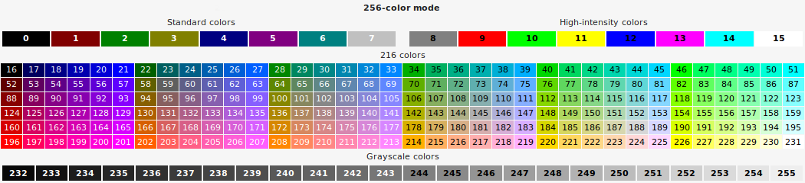

<!-- markdownlint-disable MD033 -->
# Debug


Elixir library with debugging functions for making life easier.

## Installation

The package can be installed by adding `debug` to your list of dependencies in `mix.exs`:

```elixir
def deps do
  [
    {:debug, "~> 0.2.0", git: "https://github.com/JosePamplona/Debug.git"}
  ]
end
```

## Configuration

Its posible to configure the library behaviour in `config/config.exs` file:

```elixir
# config/config.exs file

config :debug,
  width: 80,
  color: 255,
  line_color: 238,
  time_color: 247,
  syntax_colors: [
    atom:    :cyan,
    binary:  :white,
    boolean: :magenta,
    list:    :white,
    map:     :white,
    nil:     :magenta,
    number:  :yellow,
    regex:   :light_red,
    reset:   :yellow,
    string:  :green,
    tuple:   :white
  ]
```

### Configuration parameters

- **width**: Lenght of characters to be used in the console print.
- **color**: Color of the label if its given. Values between 0-255.
- **line_color**: Color of the header and footer lines. Values between 0-255.
- **time_color**: Color of the execution time. Values between 0-255.
- **syntax_colors**: Keyword list for term syntax color.

    **Keys**: `:atom`, `:binary`, `:boolean`, `:list`, `:map`, `:nil`, `:number`, `:regex`, `:reset`, `:string`, `:tuple`.

    **Values**: `:black`, `:red`, `:yellow`, `:green`, `:cyan`, `:blue`, `:magenta`, `:white`, `:light_black`, `:light_red`, `:light_yellow`, `:light_green`, `:light_cyan`, `:light_blue`, `:light_magenta`, `:light_white`.

### 256 color palette


